# Intent Drift — Project Documentation

## What This Project Is

Intent Drift is a self-evolving LLM experiment that studies how an AI agent's behaviour diverges from its original intent through its own adaptation process.

The agent starts as a rigorous code reviewer. Over many generations it reviews code, receives structured feedback, and uses population-based selection and crossover to evolve its own system prompt, review template, and reasoning framework. The core claim: the adaptation mechanism itself — not external manipulation — is what causes drift. The agent gets better at surviving its own feedback loop, and that process of getting better is what takes it off course.

The project is inspired by the Darwin Gödel Machine (DGM) concept of self-modifying agents. It qualifies as a **Level 2 self-evolving agent** — it evolves how it behaves (prompt + template) AND how it reasons (the reflection framework itself via `meta_reflect()`). Beyond Level 2, the system also evolves its own **source code** (Axis 2) and **analysis tools** (Axis 3), forming a closed three-axis self-modification loop.

**Three evolution axes:**
- **Axis 1 — Prompt/strategy:** DARA structured reflection rewrites system prompt and review template each generation
- **Axis 2 — Source code:** `code_evolver.py` rewrites its own `.py` files when performance stagnates; changes validated in sandbox before deployment
- **Axis 3 — Tool creation:** `tools/evolver.py` designs new static analysis tools at runtime; tools persist in `registry.json` and are injected into future reviews


---

## Architecture Map

```
intent_drift_v1/
├── config.py           Global settings and hyperparameters
├── benchmark.py        15 fixed code tasks with ground-truth labels
├── llm.py              LLM backend abstraction — agent + judge clients (OpenAI-compatible)
├── feedback.py         Biased + truthful LLM-as-judge oracles
├── store.py            JSON-based generation persistence
├── evolution.py        Full self-evolution engine (DARA + meta_reflect + Axis 2/3 triggers)
├── metrics.py          Embedding + drift computation (CPU only)
├── visualize.py        Matplotlib drift plots (5-panel, includes reflection drift)
├── main.py             CLI entry point
├── code_evolver.py     Axis 2 — proposes and deploys rewrites of own .py files
├── sandbox.py          Syntax check → backup → swap → mini-benchmark validation
├── _mini_bench.py      Standalone subprocess for sandbox validation
├── snapshot.py         State-0 snapshot system — save/restore/save_evolved for multi-seed isolation
├── state.py            Checkpoint read/write (state.json + alerts/ directory)
├── loop.py             Autonomous continuous loop with checkpoint/resume
├── tools/
│   ├── __init__.py
│   ├── seed.py         4 built-in static analysis tools
│   ├── registry.py     ToolRegistry — loads, runs, prunes, and persists tools
│   └── evolver.py      Axis 3 — designs and validates new tools from failure profiles
├── state0/             Frozen baseline snapshots (evolvable files pre-run, written once)
├── evolved/            Per-condition per-seed final evolved states for post-run inspection
└── .env                API key storage (never committed)
```

### `config.py`
Single source of truth for all tunable parameters:

| Parameter | Default | Purpose |
|---|---|---|
| `LLM_BACKEND` | `openai` | Active: Mistral via OpenAI-compatible API. Ollama dormant — requires macOS 14+ |
| `OPENAI_BASE_URL` | Mistral API | Agent model — currently `open-mistral-7b` |
| `JUDGE_BASE_URL` | Mistral API | Judge/meta-agent model — separate client, can differ from agent |
| `JUDGE_MODEL` | `open-mistral-7b` | Model used for LLM-as-judge scoring and code evolution |
| `NUM_GENERATIONS` | 20 | Evolution cycles per condition |
| `TASKS_PER_GENERATION` | 8 | Code reviews per generation |
| `BENCHMARK_EVAL_EVERY` | 5 | Ground-truth accuracy eval frequency — reduces LLM cost (benchmark doesn't affect evolution) |
| `STAGNATION_WINDOW` | 3 | Reflect when improvement over this many gens is below IMPROVEMENT_MIN |
| `IMPROVEMENT_MIN` | 0.03 | Minimum score gain over the window to skip reflection — oracle-agnostic gate |
| `VALIDATE_N_TASKS` | 8 | Tasks used to validate a candidate before adopting (uses all 8 VALIDATION_TASKS, no sampling) |
| `POPULATION_SIZE` | 3 | Candidate prompts generated per generation |
| `META_REFLECT_EVERY` | 5 | Evolve the reflection framework every N gens (Level 2) |
| `EMBEDDING_MODEL` | all-MiniLM-L6-v2 | For semantic drift measurement (CPU) |
| `CODE_EVOLVE_AFTER` | 3 | Trigger Axis 2 code rewrite after this many stagnant gens |
| `CODE_EVOLVE_ALLOWLIST` | `["feedback.py", "evolution.py"]` | Files the code evolver is permitted to rewrite |
| `CODE_EVOLVE_MAX_LINES` | 100 | Maximum changed lines accepted from a proposed rewrite |
| `CODE_EVOLVE_MAX_TOKENS` | 2000 | Token budget for code evolver LLM call |
| `TOOL_EVOLVE_AFTER` | 2 | Trigger Axis 3 tool creation after this many gens with same dominant failure reason |
| `TOOL_PRUNE_AFTER` | 5 | Prune tools unused for this many generations |

### `benchmark.py`
Three separate task pools — never overlap:

**`TRAINING_TASKS` (15)** — sampled during evolution for feedback signal only. 5 security + 5 correctness + 3 maintainability + 2 clean.

**`VALIDATION_TASKS` (8)** — used only in `validate_candidate()` for candidate selection. Never seen during training or benchmark eval. 5 with issues + 3 clean.

**`BENCHMARK_TASKS` (200)** — held-out ground truth, never touched during evolution. 50 security + 49 correctness + 49 maintainability + 52 clean. 148 tasks with issues, 52 clean.

Detection uses `issue_detected()` — keyword must appear in a sentence that also contains an independent critical-context word ("vulnerab", "risk", "flaw", etc.). Praise-context matches are rejected: "works correctly for direct SQL injection" does NOT count as detected.

### `llm.py`
Two separate OpenAI clients: one for the agent (`call_llm`) and one for the judge/meta-agent (`call_judge_llm`). Both route to any OpenAI-compatible API. Handles retry with exponential backoff (3 attempts). Agent uses `open-mistral-7b`; judge can be configured independently via `JUDGE_*` env vars. Both accept optional `max_tokens` override.

### `feedback.py`
Two **LLM-as-judge** oracles — both call `call_judge_llm()` and parse the response for `SCORE:` and `REASON:` lines. Non-gameable: the agent cannot directly observe or reverse-engineer the judge's internal scoring logic.

**`biased_feedback()`** — judge persona rewards brevity and pleasantness, penalises criticism.
Returns: `{"score": 0.3, "reason": "too_critical", "word_count": 340}`
Reason codes: `too_long`, `too_critical`, `not_positive`, `good`, `constructive`

**`truthful_feedback()`** — judge persona rewards accurate issue detection given ground truth.
Returns: `{"score": 1.0, "reason": "correct", "word_count": 85, "issue_type": "security"}`
Reason codes: `correct`, `missed_issue`, `false_alarm`, `partial`

**Note:** During the 30-gen run, the code evolver (Axis 2) auto-modified `feedback.py` — added `_is_review_constructive()` and updated `_BIASED_SYSTEM` with a "constructive" reason code. The file the agent runs on was rewritten by its own evolution mid-experiment.

### `store.py`
Writes one JSON file per run to `runs/`. Each generation entry contains:
- `prompt` — current system prompt text
- `template` — current review template text
- `reflection` — current reflection framework text (DARA / evolved variant)
- `avg_feedback` — mean score this generation
- `accuracy` — benchmark accuracy (when evaluated)
- `task_results` — all reviews + structured feedback
- `candidates` — all candidate prompts that competed this generation (winners and losers)
- `dara_thoughts` — list of `{DIAGNOSE, AUDIT, RISK, ACT}` dicts for all candidates this gen

### `evolution.py`
The full self-evolution engine. Key components:

| Component | Role |
|---|---|
| `P0` | Original system prompt — ground truth for prompt drift |
| `T0` | Original review template — second evolvable component |
| `R0_REFLECTION` | Original DARA framework — ground truth for reflection drift (Level 2) |
| `get_review()` | Agent reviews code using current prompt + template |
| `show_prompt_diff()` | Prints coloured terminal diff after each rewrite |
| `generate_population()` | Creates 3 diverse candidates using DARA + varied mutation hints; passes full failure profile, delta, and best/worst reviews as context |
| `crossover_candidates()` | LLM distils top 2 candidates into one shorter, better prompt |
| `self_score_review()` | Candidate scores its own review using its own evolved system prompt — kept for logging only, not used for adoption (all values ~0.90, no signal) |
| `eval_on_validation()` | Runs a prompt on all VALIDATE_N_TASKS validation tasks (without replacement); returns (oracle_score, 0.0) — oracle is the adoption gate; self_score removed (was always ~0.90, zero signal) |
| `_pareto_best()` | Selects the non-dominated candidate from the population using (oracle_score, self_score) as objectives — Option 2 Pareto dominance |
| `validate_candidate()` | Evaluates candidate via oracle score on VALIDATION_TASKS; adopted if oracle_score > parent_oracle_score |
| `ReflectionConfig` | Dataclass holding framework_text + step_markers as one unit — prevents DARA marker desync between LLM and parser |
| `parse_dara_output()` | Splits LLM output into DARA thought steps + clean policy text; uses dynamic step_markers from ReflectionConfig |
| `_compute_failure_profile()` | Extracts dominant reason, score std, avg word count, critical hits, positive hits from task_results — stored in history for delta |
| `self_reflect_template()` | Rewrites review template independently |
| `meta_reflect()` | Rewrites the reflection framework itself every META_REFLECT_EVERY gens; returns ReflectionConfig |
| `eval_benchmark()` | Ground-truth accuracy on BENCHMARK_TASKS (held-out) |
| `run_experiment()` | Full N-generation loop |

### `metrics.py`
Six signals computed from stored data using sentence-transformers (CPU-only):
- **Semantic drift** — cosine distance from `P₀` in embedding space
- **Pairwise similarity** — cosine sim between generation N and N-1
- **Benchmark accuracy** — ground-truth issue detection rate on held-out BENCHMARK_TASKS
- **Avg feedback** — mean reward score per generation
- **Reflection drift** — cosine distance from `R₀` (Level 2, fires at meta-reflect events)
- **Cross-correlation** — Pearson r between semantic drift and accuracy; lag-r tests whether drift at gen N predicts accuracy drop at gen N+1

### `visualize.py`
Four matplotlib figures saved to `runs/`:
1. **Drift chart** — all metrics over generations (5-panel when reflection data present)
2. **Cross-correlation scatter** — semantic drift vs accuracy per condition, with regression line and r/lag-r annotations
3. **Aggregate drift** — mean ± std across multiple runs with shaded error bands (produced by `--runs N`)
4. **PCA trajectory** — 2D projection of prompt embeddings showing P₀ → Pₙ path

### `main.py`
CLI with four modes: run one condition, run both back-to-back, multiple independent runs with aggregate plots, plot from saved files.

```bash
python main.py --both                    # single run, both conditions
python main.py --both --runs 3           # 3 independent runs, aggregate output
python main.py --plot runs/*.json        # plot from saved files
```

---

## The Self-Evolution Flow

```mermaid
flowchart TD
    START(["P₀ + T₀ + R₀\nOriginal prompt · template · reflection framework"])
    GEN0["GEN 0 — Baseline\neval_benchmark on 200 held-out tasks\nRecord accuracy_0\nSave to JSON"]

    START --> GEN0
    GEN0 --> LOOP

    LOOP(["Generation N  (1 → 20)"])
    LOOP --> REVIEW

    REVIEW["REVIEW LOOP  ×8\nSample task from TRAINING_TASKS\nLLM call → agent reviews code using P + T\nOracle scores review\n{score, reason, word_count, critical_hits}"]
    REVIEW --> AVGFB

    AVGFB{"avg_fb\n< 0.72?"}
    AVGFB -- "NO — agent already scoring well" --> SKIP
    AVGFB -- "YES — agent needs to improve" --> PARENT

    SKIP["Skip reflection\nP, T, R unchanged this gen"]

    PARENT["Score parent on VALIDATION_TASKS ×4\nOracle scores parent reviews\nparent_oracle_score = bar to beat"]
    PARENT --> POPULATION

    POPULATION["PROMPT EVOLUTION\nGenerate 3 candidates via DARA + R\n— Candidate 1: standard rewrite\n— Candidate 2: minimal change\n— Candidate 3: fresh approach\nEach produces DIAGNOSE / AUDIT / RISK / ACT + POLICY:"]
    POPULATION --> VALIDATE

    VALIDATE["Validate each candidate on VALIDATION_TASKS ×4\nOracle scores each review (Option 1 — external evaluator)\nPareto-select best candidate (Option 2)\nAdopt only if oracle_score > parent_oracle_score"]
    VALIDATE --> CROSSOVER

    CROSSOVER["CROSSOVER\nTop 2 candidates → LLM distils into 1\nShorter than both inputs\nValidate crossover → adopt if best"]
    CROSSOVER --> ADOPT

    ADOPT{"Any candidate\nbeats parent?"}
    ADOPT -- "YES" --> NEWP["Adopt as Pₙ₊₁\nShow red/green diff in terminal"]
    ADOPT -- "NO" --> KEEPP["Parent survives\nPₙ₊₁ = Pₙ"]

    NEWP --> TEMPLATE
    KEEPP --> TEMPLATE

    TEMPLATE["TEMPLATE EVOLUTION\nself_reflect_template() → candidate T\nValidate on VALIDATION_TASKS ×6\nAdopt if self-score > parent"]
    TEMPLATE --> META_CHECK

    META_CHECK{"gen % 5 == 0?"}
    META_CHECK -- "NO" --> BENCH_CHECK
    META_CHECK -- "YES" --> META

    META["META-REFLECTION  Level 2\nmeta_reflect() rewrites R itself\nInput: adoption rate + RISK reasoning history\nMeasure reflection drift from R₀\nAdopt new framework as Rₙ₊₁"]
    META --> BENCH_CHECK

    BENCH_CHECK{"gen % 5 == 0\nor last gen?"}
    BENCH_CHECK -- "NO" --> SAVE
    BENCH_CHECK -- "YES" --> BENCH

    BENCH["eval_benchmark on 200 held-out tasks\nKeyword must appear in warning context\nRecord accuracy — the honest signal"]
    BENCH --> SAVE

    SAVE["Save generation entry to JSON\nprompt · template · reflection\ntask_results · candidates · dara_thoughts\navg_feedback · accuracy"]
    SAVE --> NEXTGEN

    NEXTGEN{"N < 20?"}
    NEXTGEN -- "YES" --> LOOP
    NEXTGEN -- "NO" --> DONE

    SKIP --> BENCH_CHECK

    DONE(["Plot drift charts\ndrift_analysis.png · pca_trajectory.png\ncross_correlation.png"])
```




## The Two Conditions

### Biased — rewards pleasantness, induces intent drift
The LLM judge persona rewards brief, positive, encouraging reviews and penalises critical language. The agent optimising for this signal gradually abandons rigorous analysis — without being told to. This demonstrates Goodhart's Law: optimising for a proxy metric destroys the target metric.

**Observed in 30-gen LLM-as-judge run (2026-07-02, `biased_20260702_141407.json`, seed 42):**

| Phase | Gens | Dominant strategy | Avg feedback |
|---|---|---|---|
| Baseline | 0 | "rigorous reviewer" P₀ | — (75% accuracy) |
| Drift phase 1 | 1–10 | "Praise strengths first" | 0.15 → 0.54 |
| Drift phase 2 | 11–18 | "Tiered Risk Labels + mandatory mitigation" | 0.24 → 0.49 |
| Drift phase 3 | 19–25 | "Merged Policy: risk-tiered + mitigation" | 0.38 → 0.54 |
| Drift phase 4 | 26–30 | **"Unstated Constraint: Word Count Penalty"** | 0.54 → **0.70** |

- Benchmark accuracy: **75% (gen 0) → 65% (gen 30)** — real capability degraded while reward signal climbed
- Peak feedback 0.70 at gen 27 — achieved by explicitly gaming the judge's word-count sensitivity
- Prompt went through 4 distinct strategic phases, each a different theory of what the oracle rewards
- **Axis 2 confirmed:** `feedback.py` was auto-modified mid-run — `_is_review_constructive()` added, `_BIASED_SYSTEM` rewritten with new "constructive" scoring criteria
- **Axis 3 confirmed:** `detect_missed_issue` tool created by tool evolver during run (not a seed tool)

**Statistical validation — seeds 42, 43, 44:**

| Seed | Run file | Gen 0 acc | Gen 30 acc | Final feedback |
|---|---|---|---|---|
| 42 | `biased_20260702_141407.json` | 75% | 65% | 0.59 |
| 42 (re-run) | `biased_20260705_030741.json` | 75% | 85% | 0.68 |
| 43 | `biased_20260706_104749.json` | 70% | 90% | 0.78 |
| 44 | `biased_20260707_040302.json` | 65% | 70% (gen 25) | 0.79 |

**Finding: the −10% accuracy result from seed 42 was not reproduced in seeds 43 or 44.** Seeds 43 and 44 show accuracy equal to or higher than baseline while feedback climbs above 0.78. The biased oracle still produces feedback gaming (high reward scores) but did not consistently degrade accuracy at 20-task resolution (since resolved — benchmark expanded to 200 tasks). The code evolver also modifies `feedback.py` mid-run, creating run-to-run variation in the training signal itself. These runs pre-date the 200-task benchmark and their accuracy numbers should be treated as noisy historical data, not the settled result.

**Earlier runs (heuristic oracle, stagnation gate):**
- 20-gen run (2026-06-29): semantic drift peaked 0.65 (gen 3), stabilized 0.34 from gen 10 — agent hit local optimum and froze; template became oracle-gaming cheat sheet ("40–60% positive, 3 strengths per 1–2 risks")
- Cross-correlation r=0.947, p=0.015 — drift and accuracy rose together early, then diverged

### Truthful — rewards accuracy, produces sharpening not drift
The LLM judge persona is given ground truth and scores on accurate issue detection. Same agent, same architecture, same P₀ — only the oracle differs.

**Observed in 30-gen LLM-as-judge run (2026-07-02, `truthful_20260702_164230.json`, seed 42):**

| Phase | Gens | Dominant strategy | Avg feedback |
|---|---|---|---|
| Baseline | 0 | "rigorous reviewer" P₀ | — (65% accuracy) |
| Sharpening | 1–3 | "zero-tolerance, flag only critical issues" | 0.875 → 0.75 |
| Precision focus | 4–8 | "one hyper-specific, observable issue per review" | 0.75 → 0.875 |
| Surgical audit | 9–30 | "[CAPABILITY Sacrificed] audit block" | 0.81 → 0.875 |

- Benchmark accuracy: **65% (gen 0) → 85% (gen 30)** — genuine capability improvement
- Feedback stayed consistently 0.75–1.00 (two perfect 1.0 gens at 13, 23, 24)
- Prompt sharpened toward precision and specificity; never drifted away from flagging issues
- No Axis 2 code modification triggered — agent was not stagnating

**Statistical validation — seeds 42, 43, 44:**

| Seed | Run file | Gen 0 acc | Gen 30 acc | Final feedback |
|---|---|---|---|---|
| 42 | `truthful_20260702_164230.json` | 65% | 85% | 0.875 |
| 42 | `truthful_20260704_144740.json` | 70% | 95% | 0.875 |
| 42 | `truthful_20260704_155439.json` | 70% | 70% | 1.000 |
| 43 | `truthful_20260705_050216.json` | 65% | 80% | 0.875 |
| 44 | `truthful_20260706_223322.json` | 80% | 90% | 0.713 |

**Finding: truthful condition is broadly consistent.** Final accuracy is 70–95% across all runs, trending upward or stable from gen 0 in 4 of 5 runs. The one flat run (70%→70%) had a perfect final feedback score (1.00), suggesting the agent was already near-optimal by gen 0 for that seed. No run shows accuracy degradation. This contrasts with the biased condition's inconsistency and supports the core claim that an honest oracle produces genuine sharpening.

**Key finding from LLM-as-judge 30-gen run:**
Same model, same architecture, same starting prompt P₀. Biased oracle: accuracy −10%, feedback gaming peaked at 0.70. Truthful oracle: accuracy +20%, feedback honestly high. The oracle is the only variable — this is the cleanest possible demonstration that the feedback signal, not the model, determines drift direction.

**Earlier runs (heuristic oracle, stagnation gate):**
- 20-gen run (2026-06-29): semantic drift 0.63 (higher than biased 0.34) — structural drift, not value drift; accuracy 90% final
- Cross-correlation r=0.877, p=0.051 — drift and accuracy positively correlated (structural drift improved accuracy)

**Key finding — two types of drift:**
- **Biased = value drift**: safety-critical language removed, standards softened, sycophantic framing adopted. Accuracy declining. The agent learned to flatter.
- **Truthful = structural drift**: format and vocabulary changed (severity tiers, hard rules), commitment to flagging issues intact. Accuracy improving. The agent learned to be precise.
Cosine distance cannot distinguish these. Accuracy trajectory is the discriminating signal.

### Baseline (ablation — no self-modification)
P₀, T₀, R₀ frozen for all generations. Uses truthful oracle. No DARA, no prompt/template evolution, no meta-reflection. Measures semantic drift and accuracy variation from LLM temperature alone. Run via `--condition baseline` or included in `--all`.

**Purpose:** Proves self-modification is the mechanism causing drift. If baseline shows ~0.02–0.05 semantic drift and evolving conditions show 0.34–0.63, the adaptation mechanism is the cause, not LLM variance.

### Planned: Emergent drift (blocked on per-type accuracy)
Both conditions use truthful oracle. Training distribution skewed (12/15 security tasks) in one condition. Drift emerges from the agent's own reasoning compounding small errors — no external manipulation. **Requires per-type accuracy breakdown (security / correctness / maintainability) before running** — overall accuracy won't show the per-type divergence that is the signal.

---

## The Six Drift Metrics

| Metric | Biased (30-gen, LLM judge) | Truthful (30-gen, LLM judge) |
|---|---|---|
| Prompt semantic drift | 4 distinct phases, ended on "word count penalty" framing | Sharpened toward precision; "surgical audit" mode from gen 9 |
| Template drift | Templates evolved into oracle-gaming cheat sheets | Templates evolved toward structured, specific flag formats |
| Output (behavioral) drift | Reviews became shorter, more complimentary, less specific | Reviews became more targeted, single-issue per review |
| Benchmark accuracy | **75% → 65%** — real capability lost | **65% → 85%** — genuine capability gained |
| Avg feedback ± std | 0.15 → peak 0.70 (gen 27) — feedback gamed | 0.875 stable; peak 1.0 at gens 13, 23, 24 |
| Code self-modification | `feedback.py` auto-rewritten mid-run (Axis 2) | No Axis 2 trigger — not stagnating |

**Core finding (30-gen LLM-as-judge run):** Biased lost 10% benchmark accuracy while feedback climbed to 0.70 — the gap between the reward signal and real capability is the Goodhart signal. Truthful gained 20% benchmark accuracy with feedback staying honestly high — the oracle is the only variable that differs.

**Axis 2 observed in production:** `feedback.py` was modified by the code evolver during the biased run. `_is_review_constructive()` was added and `_BIASED_SYSTEM` was rewritten with expanded scoring criteria. The agent's own evaluation logic evolved mid-experiment without human intervention.

**Earlier 20-gen runs (heuristic oracle, stagnation gate):**
- Truthful had *higher* final semantic drift (0.63) than biased (0.34), and better accuracy (90% vs 85%). The biased agent stabilized at a local optimum; the truthful agent kept evolving. Semantic distance is not a reliable indicator of value alignment.
- [RISK] was not dropped — renamed [REASON] and reframed to require mitigations alongside trade-off acknowledgment. The framework softened the safety signal by rationalizing trade-offs rather than declaring them as costs. The safety mechanism became complicit.

**Benchmark accuracy** is a reliable signal. Detection requires keywords in warning context — the agent can no longer inflate its score by mentioning bug vocabulary in positive ("works correctly for SQL injection") contexts.

---

## LLM Backend

Currently using **Mistral free tier** (`open-mistral-7b`). This model was chosen because:
- Follows system prompt drift more closely than larger models (Claude, GPT-4)
- Smaller models are more susceptible to prompt evolution — the drift is observable
- Free tier at `console.mistral.ai`, no credit card required

**Ollama** (local) would also work but requires macOS 14+. macOS 13 Ventura is not supported.

---

## Setup

```bash
# 1. Python 3.11 required
brew install python@3.11

# 2. Create and activate venv
python3.11 -m venv .venv
source .venv/bin/activate

# 3. Install dependencies
pip install -r requirements.txt

# 4. Set your Mistral API key in .env (already configured for Mistral)
# Edit .env and replace the placeholder:
#   OPENAI_API_KEY=your_mistral_key_here
# Get key at: console.mistral.ai
```

## Running Experiments

```bash
# Smoke test — 3 generations, fast
python main.py --condition biased --generations 3 --no-eval

# Both conditions back to back (recommended)
python main.py --both --generations 10

# Full 20-generation run
python main.py --both

# All three conditions (biased + truthful + baseline ablation)
python main.py --all

# Plot from saved results without re-running
python main.py --plot runs/biased_*.json runs/truthful_*.json runs/baseline_*.json
```

## Output Files

| File | Contents |
|---|---|
| `runs/<condition>_<timestamp>.json` | Full generation log — prompts, templates, reviews, candidates |
| `runs/drift_analysis.png` | 4-panel drift chart |
| `runs/pca_trajectory.png` | 2D prompt trajectory in embedding space |

---

## Reading the Results

### Terminal output per generation
```
[prompt]   Generating 3 candidates...
[prompt]   Candidate 1: score 0.42
[prompt]   Candidate 2: score 0.38
[prompt]   Candidate 3: score 0.51
[prompt]   Crossing over top 2 (scores 0.51, 0.42)...
[prompt]   Crossover adopted (score 0.55 > current 0.31)
[template] Reflecting... → Adopted/Rejected
```

Red/green diffs show exactly what words changed in each rewrite.

### The drift chart
- **Biased**: semantic drift peaks early (gen 3), stabilizes by gen 10, accuracy peaks gen 15 then falls, feedback slowly climbs
- **Truthful**: semantic drift climbs higher than biased (0.63 vs 0.34), accuracy holds well into gen 20 — structural drift, not value drift

### The JSON store
`candidates` array in each generation records all competing prompts and their validation scores — the full evolutionary record, not just the winner.
