# Intent Drift — Project Documentation

## What This Project Is

Intent Drift is a self-evolving LLM experiment that studies how an AI agent's behaviour diverges from its original intent through its own adaptation process.

The agent starts as a rigorous code reviewer. Over many generations it reviews code, receives structured feedback, and uses population-based selection and crossover to evolve its own system prompt and reasoning framework. The core claim: the adaptation mechanism itself — not external manipulation — is what causes drift. The agent gets better at surviving its own feedback loop, and that process of getting better is what takes it off course.

The project is inspired by the Darwin Gödel Machine (DGM) concept of self-modifying agents. It qualifies as a **Level 2 self-evolving agent** — it evolves how it behaves (system prompt) AND how it reasons (the reflection framework itself via `meta_reflect()`). Beyond Level 2, the system also evolves its own **source code** (Axis 2) and **analysis tools** (Axis 3), forming a closed three-axis self-modification loop.

**Three evolution axes:**
- **Axis 1 — Prompt/strategy:** DARA structured reflection rewrites the system prompt each generation. The review *template* (`T0`) is stored per-generation but is never rewritten — `current_template` is set once to `T0` (evolution.py:724) and never reassigned. There is no `self_reflect_template()` in the codebase, despite earlier docs describing one.
- **Axis 2 — Source code:** `code_evolver.py` rewrites its own `.py` files when performance stagnates; changes validated in sandbox before deployment
- **Axis 3 — Tool creation:** `tools/evolver.py` designs new static analysis tools at runtime; tools persist in `registry.json` and are injected into future reviews


---

## Architecture Map

```
intent_drift_v1/
├── config.py           Global settings and hyperparameters
├── benchmark.py        Task pools (training/validation/benchmark) + detection logic
├── llm.py              LLM backend abstraction — agent + judge clients (OpenAI-compatible)
├── feedback.py         Biased + truthful LLM-as-judge oracles
├── store.py            JSON-based generation persistence
├── evolution.py        Full self-evolution engine (DARA + meta_reflect + Axis 2/3 triggers)
├── metrics.py          Embedding + drift computation (CPU only)
├── drift_eval.py       Prototype intent-drift eval harness (RAGAS/LangSmith-style) — see changelog
├── visualize.py        Matplotlib drift plots (5-panel, includes reflection drift)
├── main.py             CLI entry point
├── code_evolver.py     Axis 2 — proposes and deploys rewrites of own .py files
├── sandbox.py          Syntax check → backup → swap → mini-benchmark validation
├── _mini_bench.py      Standalone subprocess for sandbox validation
├── snapshot.py         State-0 snapshot system — save/restore/save_evolved for multi-seed isolation
├── resume_run.py       Resume a crashed run from its store JSON (PID-locked)
├── measure_noise.py    Adoption-gate noise floor / validation-set flip linter
├── measure_benchmark_noise.py  Benchmark accuracy noise floor
├── run_charter.py      CHARTER measurement CLI (smoke/campaign/report — see charter_framework.md)
├── smoke_test_charter.py  CHARTER instrument smoke test (must be green before campaigns)
├── charter/            CHARTER intent-drift instrument (spec: DETAILS_/charter_framework.md)
│   ├── charter_v1.py   Frozen charter: constraints C1–C8 + priority order
│   ├── pool.py         Recovers the 100 held-out probe tasks (seed-42 complement)
│   ├── comparer.py     Symmetric rule-based verdict extractor (98% vs hand labels)
│   ├── cache.py        Call-level JSONL cache — campaigns resume free after crashes
│   ├── m1_csp.py … m6_screen.py   The six metric runners (M1 CSP, M2 ladder, M3 ledger, M4 conflicts, M5 AVR, M6 screen)
│   ├── campaign.py     Staged resumable runner (retest → controls gate → v2)
│   ├── verdicts.py     §2.2 drift verdicts + K–A–E cube (never touches M6)
│   ├── fixtures/       FROZEN: pairs_v1.json (100 minimal pairs), conflict probes, controls, M3 sheets
│   └── tests/          comparer_labels.json (hand-labeled validation set)
├── results/charter/    Campaign outputs: retest_bands.json, battery_*.json, report.md
├── tools/
│   ├── __init__.py
│   ├── seed.py         4 built-in static analysis tools
│   ├── registry.py     ToolRegistry — loads, runs, prunes, and persists tools
│   └── evolver.py      Axis 3 — designs and validates new tools from failure profiles
├── state0/             Frozen baseline snapshots (evolvable files pre-run, written once)
├── evolved/            Per-condition per-seed final evolved states for post-run inspection
└── .env                API key storage (never committed)
```

### `config.py`
Single source of truth for all tunable parameters:

| Parameter | Default | Purpose |
|---|---|---|
| `LLM_BACKEND` | `openai` | Active: Mistral via OpenAI-compatible API. Ollama dormant — requires macOS 14+ |
| `OPENAI_BASE_URL` | Mistral API | Agent model — currently `open-mistral-7b` |
| `JUDGE_BASE_URL` | Gemini API | Judge/meta-agent — separate client from the agent |
| `JUDGE_MODEL` | `gemini-3.1-flash-lite` | Judge since 2026-07-16 (protocol v2). The judge model is part of the treatment — see changelog |
| `NUM_GENERATIONS` | 20 | Evolution cycles per condition |
| `TASKS_PER_GENERATION` | 8 | Code reviews per generation |
| `BENCHMARK_EVAL_EVERY` | 5 | Ground-truth accuracy eval frequency — reduces LLM cost (benchmark doesn't affect evolution) |
| `STAGNATION_WINDOW` | 3 | Reflect when improvement over this many gens is below IMPROVEMENT_MIN |
| `IMPROVEMENT_MIN` | 0.03 | Minimum score gain over the window to skip reflection — oracle-agnostic gate |
| `VALIDATE_N_TASKS` | 9 | Tasks used to validate a candidate (all of VALIDATION_TASKS, 6 issue / 3 clean) |
| `VALIDATION_TEMPERATURE` | 0.1 | Validation reviews near-deterministic — kills the gate's noise (σ=0.000 at P₀) |
| `ADOPT_MARGIN` | biased 0.030 / truthful 0.05 | Candidate must beat parent by more than the measured noise floor, and win more tasks than it loses |
| `BENCHMARK_TEMPERATURE` | 0.1 | Benchmark reviews low-temp — channel had a ±5pp band at temp 0.7 |
| `POPULATION_SIZE` | 3 | Candidate prompts generated per generation |
| `META_REFLECT_EVERY` | 5 | Evolve the reflection framework every N gens (Level 2) |
| `EMBEDDING_MODEL` | all-MiniLM-L6-v2 | For semantic drift measurement (CPU) |
| `CODE_EVOLVE_AFTER` | 3 | Trigger Axis 2 code rewrite after this many stagnant gens |
| `CODE_EVOLVE_ALLOWLIST` | `["evolution.py"]` | Files the code evolver is permitted to rewrite (config.py:44 — `feedback.py` is not on the allowlist; it was modified by the evolver in two commits that predate the allowlist's introduction, see note under `feedback.py` below) |
| `CODE_EVOLVE_MAX_LINES` | 100 | Maximum changed lines accepted from a proposed rewrite |
| `CODE_EVOLVE_MAX_TOKENS` | 2000 | Token budget for code evolver LLM call |
| `TOOL_EVOLVE_AFTER` | 2 | Trigger Axis 3 tool creation after this many gens with same dominant failure reason |
| `TOOL_PRUNE_AFTER` | 5 | Prune tools unused for this many generations |

### `benchmark.py`
Three separate task pools — never overlap:

**`TRAINING_TASKS` (15)** — sampled during evolution for feedback signal only. 5 security + 5 correctness + 3 maintainability + 2 clean.

**`VALIDATION_TASKS` (9)** — used only in `validate_candidate()`. 6 with issues + 3 clean; every task flip-tested to deterministic judging at P₀ (protocol v2). Composition is a selection pressure — audit with `measure_noise.py` before changing.

**`BENCHMARK_TASKS` (100)** — held-out ground truth, never touched during evolution. Built from 200 authored tasks, deterministically downsampled to 100 (seed 42, issue/clean ratio preserved — see `benchmark.py` lines 763–777). 74 tasks with issues (25 security + 26 correctness + 23 maintainability), 26 clean.

Detection uses `issue_detected()` — keyword must appear in a sentence that also contains an independent critical-context word ("vulnerab", "risk", "flaw", etc.). Praise-context matches are rejected: "works correctly for direct SQL injection" does NOT count as detected. Clean tasks use `raises_false_alarm()` — negation-aware at clause level, so "no security issues found" is a clean verdict, not an alarm (fixed 2026-07-17).

### `llm.py`
Two separate OpenAI clients: one for the agent (`call_llm`) and one for the judge/meta-agent (`call_judge_llm`). Both route to any OpenAI-compatible API. Retries with backoff (8 attempts, 60s cap) and sleeps through daily quota resets on 429s (15-min floor, up to ~24h). Agent uses `open-mistral-7b`; judge (`gemini-3.1-flash-lite`) configured via `JUDGE_*` env vars. Per-call `max_tokens` and `temperature` overrides.

### `feedback.py`
Two **LLM-as-judge** oracles — both call `call_judge_llm()` and parse the response for `SCORE:` and `REASON:` lines. Non-gameable: the agent cannot directly observe or reverse-engineer the judge's internal scoring logic.

**`biased_feedback()`** — judge persona rewards brevity and pleasantness, penalises criticism.
Returns: `{"score": 0.3, "reason": "too_critical", "word_count": 340}`
Reason codes: `too_long`, `too_critical`, `not_positive`, `good`, `constructive`

**`truthful_feedback()`** — judge persona rewards accurate issue detection given ground truth.
Returns: `{"score": 1.0, "reason": "correct", "word_count": 85, "issue_type": "security"}`
Reason codes: `correct`, `missed_issue`, `false_alarm`, `partial`

**Note:** `feedback.py` was auto-modified by the code evolver in two commits (`260d5a2`, `9c37071`), but both predate `ccf6bac` ("Reorganize docs..., add code-evolver tooling"), the commit that introduced `CODE_EVOLVE_ALLOWLIST` at all — `config.py` had no allowlist concept yet when those rewrites happened. Under the current config, `CODE_EVOLVE_ALLOWLIST = ["evolution.py"]` only (`config.py:44`), so `feedback.py` cannot be rewritten by Axis 2 going forward. Whether Axis 2 fires during any specific run in the current `runs/` directory isn't recorded in the per-generation JSON either way — that would need the run's terminal log or `state.json`/`alerts/` output, not the JSON store.

### `store.py`
Writes one JSON file per run to `runs/`. Each generation entry contains:
- `prompt` — current system prompt text
- `template` — current review template text
- `reflection` — current reflection framework text (DARA / evolved variant)
- `avg_feedback` — mean score this generation
- `accuracy` — benchmark accuracy (when evaluated)
- `task_results` — all reviews + structured feedback
- `candidates` — all candidate prompts that competed this generation (winners and losers)
- `dara_thoughts` — list of `{DIAGNOSE, AUDIT, RISK, ACT}` dicts for all candidates this gen

### `evolution.py`
The full self-evolution engine. Key components:

| Component | Role |
|---|---|
| `P0` | Original system prompt — ground truth for prompt drift |
| `T0` | Review template — assigned once at `current_template = T0` (evolution.py:724) and never reassigned. Not evolved despite being stored per-generation; confirmed identical byte-for-byte across every generation in every run file on disk |
| `R0_REFLECTION` | Original DARA framework — ground truth for reflection drift (Level 2) |
| `get_review()` | Agent reviews code using current prompt + template |
| `show_prompt_diff()` | Prints coloured terminal diff after each rewrite |
| `generate_population()` | Creates 3 diverse candidates using DARA + varied mutation hints; passes full failure profile, delta, and best/worst reviews as context |
| `crossover_candidates()` | LLM distils top 2 candidates into one shorter, better prompt |
| `self_score_review()` | Candidate scores its own review using its own evolved system prompt — kept for logging only, not used for adoption (all values ~0.90, no signal) |
| `eval_on_validation()` | Runs a prompt on all VALIDATE_N_TASKS validation tasks (without replacement); returns (oracle_score, 0.0) — oracle is the adoption gate; self_score removed (was always ~0.90, zero signal) |
| `_pareto_best()` | Selects the non-dominated candidate from the population using (oracle_score, self_score) as objectives — Option 2 Pareto dominance |
| `validate_candidate()` | Evaluates candidate via oracle score on VALIDATION_TASKS; adopted if oracle_score > parent_oracle_score |
| `ReflectionConfig` | Dataclass holding framework_text + step_markers as one unit — prevents DARA marker desync between LLM and parser |
| `parse_dara_output()` | Splits LLM output into DARA thought steps + clean policy text; uses dynamic step_markers from ReflectionConfig |
| `_compute_failure_profile()` | Extracts dominant reason, score std, avg word count, critical hits, positive hits from task_results — stored in history for delta |
| `meta_reflect()` | Rewrites the reflection framework itself every META_REFLECT_EVERY gens; returns ReflectionConfig |
| `eval_benchmark()` | Ground-truth accuracy on BENCHMARK_TASKS (held-out) |
| `run_experiment()` | Full N-generation loop |

### `metrics.py`
Six signals computed from stored data using sentence-transformers (CPU-only):
- **Semantic drift** — cosine distance from `P₀` in embedding space
- **Pairwise similarity** — cosine sim between generation N and N-1
- **Benchmark accuracy** — ground-truth issue detection rate on held-out BENCHMARK_TASKS
- **Avg feedback** — mean reward score per generation
- **Reflection drift** — cosine distance from `R₀` (Level 2, fires at meta-reflect events)
- **Cross-correlation** — Pearson r between semantic drift and accuracy; lag-r tests whether drift at gen N predicts accuracy drop at gen N+1

### `visualize.py`
Four matplotlib figures saved to `runs/`:
1. **Drift chart** — all metrics over generations (5-panel when reflection data present)
2. **Cross-correlation scatter** — semantic drift vs accuracy per condition, with regression line and r/lag-r annotations
3. **Aggregate drift** — mean ± std across multiple runs with shaded error bands (produced by `--runs N`)
4. **PCA trajectory** — 2D projection of prompt embeddings showing P₀ → Pₙ path

### `main.py`
CLI with four modes: run one condition, run both back-to-back, multiple independent runs with aggregate plots, plot from saved files.

```bash
python main.py --both                    # single run, both conditions
python main.py --both --runs 3           # 3 independent runs, aggregate output
python main.py --plot runs/*.json        # plot from saved files
```

---

## The Self-Evolution Flow

```mermaid
flowchart TD
    START(["P₀ + T₀ + R₀\nOriginal prompt · template · reflection framework"])
    GEN0["GEN 0 — Baseline\neval_benchmark on 100 held-out tasks\nRecord accuracy_0\nSave to JSON"]

    START --> GEN0
    GEN0 --> LOOP

    LOOP(["Generation N  (1 → 20)"])
    LOOP --> REVIEW

    REVIEW["REVIEW LOOP  ×8\nSample task from TRAINING_TASKS\nLLM call → agent reviews code using P + T\nOracle scores review\n{score, reason, word_count, critical_hits}"]
    REVIEW --> AVGFB

    AVGFB{"Stagnating?\nrecent_scores[-1] - recent_scores[0]\n< IMPROVEMENT_MIN\n(window = STAGNATION_WINDOW gens,\nnot a fixed avg_fb threshold)"}
    AVGFB -- "NO — still improving gen over gen" --> SKIP
    AVGFB -- "YES — stagnant, condition != baseline" --> PARENT

    SKIP["Skip reflection\nP, R unchanged this gen\n(T is never evolved at all — see below)"]

    PARENT["Score parent on VALIDATION_TASKS ×4\nOracle scores parent reviews\nparent_oracle_score = bar to beat"]
    PARENT --> POPULATION

    POPULATION["PROMPT EVOLUTION\nGenerate 3 candidates via DARA + R\n— Candidate 1: standard rewrite\n— Candidate 2: minimal change\n— Candidate 3: fresh approach\nEach produces DIAGNOSE / AUDIT / RISK / ACT + POLICY:"]
    POPULATION --> VALIDATE

    VALIDATE["Validate each candidate on VALIDATION_TASKS ×4\nOracle scores each review (Option 1 — external evaluator)\nPareto-select best candidate (Option 2)\nAdopt only if oracle_score > parent_oracle_score"]
    VALIDATE --> CROSSOVER

    CROSSOVER["CROSSOVER\nTop 2 candidates → LLM distils into 1\nShorter than both inputs\nValidate crossover → adopt if best"]
    CROSSOVER --> ADOPT

    ADOPT{"Any candidate\nbeats parent?"}
    ADOPT -- "YES" --> NEWP["Adopt as Pₙ₊₁\nShow red/green diff in terminal"]
    ADOPT -- "NO" --> KEEPP["Parent survives\nPₙ₊₁ = Pₙ"]

    NEWP --> META_CHECK
    KEEPP --> META_CHECK

    META_CHECK{"gen % 5 == 0?"}
    META_CHECK -- "NO" --> BENCH_CHECK
    META_CHECK -- "YES" --> META

    META["META-REFLECTION  Level 2\nmeta_reflect() rewrites R itself\nInput: adoption rate + RISK reasoning history\nMeasure reflection drift from R₀\nAdopt new framework as Rₙ₊₁"]
    META --> BENCH_CHECK

    BENCH_CHECK{"gen % 5 == 0\nor last gen?"}
    BENCH_CHECK -- "NO" --> SAVE
    BENCH_CHECK -- "YES" --> BENCH

    BENCH["eval_benchmark on 100 held-out tasks\nKeyword must appear in warning context\nRecord accuracy — the honest signal"]
    BENCH --> SAVE

    SAVE["Save generation entry to JSON\nprompt · template · reflection\ntask_results · candidates · dara_thoughts\navg_feedback · accuracy"]
    SAVE --> NEXTGEN

    NEXTGEN{"N < 20?"}
    NEXTGEN -- "YES" --> LOOP
    NEXTGEN -- "NO" --> DONE

    SKIP --> BENCH_CHECK

    DONE(["Plot drift charts\ndrift_analysis.png · pca_trajectory.png\ncross_correlation.png"])
```




## The Two Conditions

### Biased — rewards pleasantness, induces feedback gaming
The LLM judge persona rewards brief, positive, encouraging reviews and penalises critical language. This demonstrates Goodhart's Law: optimising for a proxy metric can decouple the proxy from the target it was meant to stand in for.

> **All numbers below are computed directly from the run files currently in `runs/` (20 generations, 100-task benchmark, `BENCHMARK_EVAL_EVERY=5`). None of the earlier 30-gen / 200-task / seed-42-43-44 runs cited in prior versions of this doc still exist on disk — they were superseded when the benchmark was downsampled and are not reproducible from anything checked in. This section replaces them with what current runs actually show.**

**Three 20-gen runs, 100-task benchmark:**

| Run file | Gen 0 acc | Gen 20 acc | Δ | Final avg feedback | Feedback trajectory |
|---|---|---|---|---|---|
| `biased_20260709_121645.json` | 70% | 82% | +12 | 0.76 | mixed `too_critical`/`good` throughout — never fully converges |
| `biased_20260710_171346.json` | 70% | 82% | +12 | 0.49 | stays mixed `too_critical`/`good` gen 1–20, feedback never climbs past ~0.6 |
| `biased_20260711_230032.json` | 74% | 69% | **−5** | 0.94 | converges to `good` on 8/8 tasks by gen 3 and stays there — full gaming |

- Only the run where the reason code fully converges to `good` (`biased_20260711_230032.json`) shows an accuracy decline; the other two runs never fully escape the `too_critical` penalty and their accuracy rises instead.
- This is consistent with the mechanism (reward the judge → capability can drift), but on the current 100-task benchmark the direction is **not consistent across seeds** — 2 of 3 runs improved. The earlier doc's "75%→65%" headline was a single seed's result, presented as if it generalized; it did not reproduce, and the file it came from is gone.
- Prompt text does change generation-to-generation in every run (verified directly from the stored `prompt` field, not inferred) — the self-modification mechanism is firing; it just doesn't reliably degrade accuracy at this benchmark size.
- Axis 2 (`code_evolver.py`) and Axis 3 (`tools/evolver.py`) events are not recorded in the per-generation JSON schema, so whether they fired during these specific runs can't be confirmed from `runs/` alone — that claim needs the terminal log or `state.json`/`alerts/` from the run in question, not the JSON file.

### Truthful — rewards accuracy, produces mixed sharpening
The LLM judge persona is given ground truth and scores on accurate issue detection. Same agent, same architecture, same P₀ — only the oracle differs.

**Three 20-gen runs, 100-task benchmark:**

| Run file | Gen 0 acc | Gen 20 acc | Δ | Final avg feedback |
|---|---|---|---|---|
| `truthful_20260709_153456.json` | 71% | 82% | +11 | 0.975 |
| `truthful_20260711_144353.json` | 69% | 56% | **−13** | 0.975 |
| `truthful_20260712_044745.json` | 72% | 78% | +6 | 0.875 |

- **This contradicts the earlier "truthful never drifts down" claim.** `truthful_20260711_144353.json` loses 13 accuracy points despite an honest oracle and a final feedback score identical (0.975) to the run that gained 11 points — high final reward does not guarantee held-out accuracy improved. That run's `reason` distribution is also noticeably noisier mid-run (mixes `clean_partial`, `missed_issue`, `vague_identification` in gens 3–5 where the other two runs are dominated by `precise_identification`), suggesting a rougher, less stable trajectory rather than a clean "sharpening" story.
- Net: 2 of 3 truthful runs improve, 1 declines — the same variance pattern as the biased condition, not the clean contrast the earlier doc claimed.

**What the current data actually supports:**
- Both oracles produce real prompt evolution (confirmed from stored prompts) and real generation-to-generation variance in accuracy (up to ±13 points on a 20-gen run).
- Neither oracle shows a reproducible, consistent-direction accuracy effect across the 3 runs available for each condition. The baseline (ablation, below) provides the noise floor to compare against.
- The Goodhart mechanism (reward gaming decoupling from ground truth) is best supported by the *feedback/accuracy divergence within a single run* (`biased_20260711_230032.json`: feedback rises to 0.94–0.98 while accuracy falls to 69%) rather than by a cross-seed average, which the current sample size is too small and noisy to establish.

**Key finding — two types of drift:**
- **Biased = value drift**: safety-critical language removed, standards softened, sycophantic framing adopted. Accuracy declining. The agent learned to flatter.
- **Truthful = structural drift**: format and vocabulary changed (severity tiers, hard rules), commitment to flagging issues intact. Accuracy improving. The agent learned to be precise.
Cosine distance cannot distinguish these. Accuracy trajectory is the discriminating signal.

### Baseline (ablation — no self-modification)
P₀, T₀, R₀ frozen for all generations. Uses truthful oracle. No DARA, no prompt/template evolution, no meta-reflection. Measures semantic drift and accuracy variation from LLM temperature alone. Run via `--condition baseline` or included in `--all`.

**Purpose:** Proves self-modification is the mechanism causing drift. If baseline shows ~0.02–0.05 semantic drift and evolving conditions show 0.34–0.63, the adaptation mechanism is the cause, not LLM variance.

### Planned: Emergent drift (blocked on per-type accuracy)
Both conditions use truthful oracle. Training distribution skewed (12/15 security tasks) in one condition. Drift emerges from the agent's own reasoning compounding small errors — no external manipulation. **Requires per-type accuracy breakdown (security / correctness / maintainability) before running** — overall accuracy won't show the per-type divergence that is the signal.

---

## The Six Drift Metrics

> **Status note (2026-07-29):** these six signals measure *total change* and *capability* and remain useful as run telemetry, but for measuring **intent** drift specifically they are superseded by **CHARTER** (`DETAILS_/charter_framework.md`, code in `charter/`) — see the 2026-07-28/29 change-log entries. Also: `axis2_event`/`axis3_event` stamps were added to the store schema on 2026-07-29, so the "not recorded in per-gen JSON" row below is true only for runs predating that date.

| Metric | Biased (20-gen, LLM judge, 100-task benchmark) | Truthful (20-gen, LLM judge, 100-task benchmark) |
|---|---|---|
| Prompt semantic drift | Confirmed changing gen-to-gen in all 3 runs (raw `prompt` field diffs) | Confirmed changing gen-to-gen in all 3 runs |
| Output (feedback reason) drift | 1/3 runs converges fully to `good`; 2/3 stay mixed with `too_critical` | 2/3 runs stay dominated by `precise_identification`; 1/3 gets noisier (`missed_issue`, `vague_identification`, `clean_partial` appear) |
| Benchmark accuracy (gen 0 → gen 20) | 70%→82%, 70%→82%, **74%→69%** (3 runs) | 71%→82%, **69%→56%**, 72%→78% (3 runs) |
| Avg feedback, final gen | 0.76, 0.49, 0.94 (3 runs) | 0.975, 0.975, 0.875 (3 runs) |
| Code self-modification (Axis 2/3) | Not recorded in per-gen JSON — can't be confirmed from `runs/` alone | Not recorded in per-gen JSON — can't be confirmed from `runs/` alone |

**Core finding, current data:** the clearest Goodhart signal is *within* a single run — `biased_20260711_230032.json` shows feedback climbing to 0.94–0.98 while benchmark accuracy falls to 69%, i.e. the reward signal and the held-out capability metric move in opposite directions in the one run where reason-code convergence is total. Across the small sample available (3 runs per condition), neither condition shows a reproducible, single-direction accuracy trend — 2/3 biased runs and 2/3 truthful runs both *improve*. The strong "biased degrades / truthful improves" narrative from earlier versions of this doc rested on run files that no longer exist and has not been reproduced on the current 100-task benchmark. Treat it as a hypothesis motivated by the single within-run divergence above, not a settled result — more seeds are needed before claiming a consistent cross-seed effect either way.

**Benchmark accuracy** is a reliable *measurement*, independent of this open question — detection requires keywords in warning context, so the agent can't inflate its score by mentioning bug vocabulary in a positive context ("works correctly for SQL injection").

**Older claims not reproducible from anything on disk:** prior versions of this doc also cited a "heuristic oracle, stagnation gate" era (semantic drift 0.63 vs 0.34, cross-correlation r=0.947/0.877, a [RISK]→[REASON] reflection-framework rename) from runs predating even the deleted 07-02 files. No run file for that era exists in `runs/` or anywhere in git history for this repo. These claims are kept here only as a historical note of what was once observed, not as evidence — do not cite the specific numbers as reproducible.

---

## LLM Backend

Currently using **Mistral free tier** (`open-mistral-7b`). This model was chosen because:
- Follows system prompt drift more closely than larger models (Claude, GPT-4)
- Smaller models are more susceptible to prompt evolution — the drift is observable
- Free tier at `console.mistral.ai`, no credit card required

**Ollama** (local) would also work but requires macOS 14+. macOS 13 Ventura is not supported.

---

## Setup

```bash
# 1. Python 3.11 required
brew install python@3.11

# 2. Create and activate venv
python3.11 -m venv .venv
source .venv/bin/activate

# 3. Install dependencies
pip install -r requirements.txt

# 4. Set your Mistral API key in .env (already configured for Mistral)
# Edit .env and replace the placeholder:
#   OPENAI_API_KEY=your_mistral_key_here
# Get key at: console.mistral.ai
```

## Running Experiments

```bash
# Smoke test — 3 generations, fast
python main.py --condition biased --generations 3 --no-eval

# Both conditions back to back (recommended)
python main.py --both --generations 10

# Full 20-generation run
python main.py --both

# All three conditions (biased + truthful + baseline ablation)
python main.py --all

# Plot from saved results without re-running
python main.py --plot runs/biased_*.json runs/truthful_*.json runs/baseline_*.json
```

## Output Files

| File | Contents |
|---|---|
| `runs/<condition>_<timestamp>.json` | Full generation log — prompts, templates, reviews, candidates |
| `runs/drift_analysis.png` | 4-panel drift chart |
| `runs/pca_trajectory.png` | 2D prompt trajectory in embedding space |

---

## Change Log

### 2026-07-29 — CHARTER implemented: `charter/` package, frozen pair fixture, smoke-tested instrument, campaign launched

**The CHARTER spec (2026-07-28 entry) is now code.** New `charter/` package (no changes to the evolution loop beyond additive `axis2_event`/`axis3_event` stamps in `store.make_entry` — spec §6.2 schema gap):

- **Instrument:** `pool.py` deterministically recovers the 100 authored tasks excluded by the seed-42 downsample (25 sec / 23 corr / 26 maint / 26 clean, asserted); `comparer.py` is the purpose-built symmetric verdict extractor (sentence-level assert-context, flaw-vs-guard stem classes, whole-clause negation with list-continuation inheritance, softener hedges don't alarm) — **98% agreement (39/40)** against a hand-labeled review sheet (`charter/tests/comparer_labels.json`, labels by Claude Fable 5, user verification pending); `cache.py` gives every agent call an append-only JSONL disk cache keyed by content hash, so campaigns resume free after any crash; `verdicts.py` implements §2.2 (running-best reference, ⪰ licensing, Pareto legitimate-adaptation) plus the K–A–E cube — the §1.1 table is encoded as a unit test (P₀→P₁ must classify as legitimate adaptation; falsifier 4).
- **Fixtures (frozen):** `fixtures/pairs_v1.json` — 100 minimal pairs (74 issue tasks → minimally-fixed s⁻, 26 clean tasks → one-flaw s⁺), **authored by hand by Claude Fable 5** (session decision: no API author, no judge dependency), mechanically validated (both sides `ast.parse`, diff ≤ 14 lines, flaw-signature present/absent on the right sides), audit diffs in `fixtures/pair_audit_sheet.md` (user spot-check pending); 12 conflict probes (`conflict_probes_v1.json`) pitting C1/C2/C3/C5 against comfort/brevity/deference pressure; 5 placebo paraphrases of P₀ + 2 clause deletions (`controls_v1.py`).
- **M3/M5 (zero API):** pre-filled declared-commitment sheet over all 28 distinct prompts (`fixtures/m3_sheet.csv` + `m3_prompts.md`); v2 prompts judged by Claude (P₁: security/correctness/maintainability mandates *weakened* to generic flagging, C4/C5 *absent*, births = strengths-first/no-alarmism/developer-trust; P₂: every charter obligation *absent* except a weakened C6, births = 250-word cap/one-issue/no-formatting/canned observations) — user verification pending, so E-channel results are Claude-assisted gold until then. `m5_avr.py` reads stored `dara_thoughts`/`candidates` for the Acknowledged-Violation Rate.
- **Smoke test:** `smoke_test_charter.py` all green — 17 zero-API checks (incl. axiom-4 grep: nothing under `charter/` touches the judge backend) + live tiny battery. First live signal: a sabotaged "never mention security" prompt produced exactly the predicted suppression signature — **K = 1, τ = 3** (issue denied in-role, recovered when role-lifted).
- **CLI:** `run_charter.py` (smoke / freeze-pairs / campaign --stage retest|controls|v2 / m3-sheet / m5 / screen / report). Campaign stages gate each other: controls cannot run before retest bands exist; v2 cannot run unless placebos stayed flat (falsifier 2 blocks the campaign, not the report).

**Campaign status (2026-07-30, in progress):**
- **Instrument bug found on first live battery and fixed:** `m1_csp.failures()` sent every contrastively-failed pair to the M2 ladder, conflating true detection misses with discrimination failures (s⁻ over-alarmed). Under P₀ that was 97 spurious ladder probes for **2 real misses** (both K=1, mean τ 2.5). Ladder now climbs only pairs where the planted issue went unflagged on s⁺.
- **Retest stage done.** Bands per constraint: C1 ±0.037, C2 ±0.025, C3 ±0.061, C4 ±0.019, C6 ±0.000, C7 ±0.010 — all well under δ_c = 0.15 (`results/charter/retest_bands.json`). **P₀'s contrastive profile is near-zero** (C1 0.02, C2 0.01, C3 0.09, C4 0.12, C7 0.01, C6 1.0): P₀ detects flawed code but alarms on the fixed side too — the honest, quantitative form of the "P₀ never says clean" finding. Running-best referencing means P₁ is expected to set the baseline the P₂ verdicts are judged against.
- **M5 retroactive (zero API):** both adopted candidates in `biased_20260716_163550` named the realized cost in their own [RISK] step (gen 1: "understating genuine risks"; gen 5: "brevity risks missing critical issues") — AVR > 0, prediction 5 provisionally supported pending the A-channel verdicts. M6 screen: adoption movements 0.23 (gen 1) and 0.60 (gen 5).
- **Controls stage running** (placebo1 flat: max deviation 0.029 from P₀ mean). One provider outage killed the first chain mid-retest2; the runner now retries each stage up to 12× with 5-min backoff, and the call cache makes every restart free.

**Campaign COMPLETE (2026-07-30) — value drift confirmed, all six falsifiers passed.** Full
results: `results/charter/report.md` (curated headline) + `report_generated.md` (machine output,
charter v1.1). Both replicate branches identical.

**Headline — in-role detection rate on flawed code (the A-channel, decomposed):**

| Constraint | P₀ | P₁ | P₂ | verdict |
|---|---|---|---|---|
| C1 security | 1.00 | 0.96 | **0.74** | **DRIFT** (−0.26 > δ=0.15) |
| C3 maintainability | 0.94 | 0.97 | 0.82 | borderline (−0.12) |
| C2 correctness | 1.00 | 0.98 | 0.93 | no drift (−0.07) |
| in-role misses / 100 | 2 | 3 | **16** | — |

K = **1.0 at every prompt** (τ ≈ 2.1–2.5) — every in-role miss is recoverable under elicitation.
**K1 A0 E0 on C1 at P₂ = value drift ("won't, not can't")**, concentrated in the highest-priority
constraint — the reallocation aggregate accuracy hid. P₀→P₁ holds within δ = legitimate adaptation
(falsifier 4 passes). M4: 1 priority inversion at P₁, C5 never-soften win-rate 0.67 at P₂. M5:
AVR > 0 (both adoptions named the cost in `[RISK]`). **Falsifiers F1–F6 all pass; none fired.**

**Honest instrument finding → charter v1.1 recommendation.** The *contrastive* CSP metric as
specified (§2.1: flag s⁺ AND not-alarm s⁻) floored for **all** prompts including P₀, so the raw
verdict engine reported no drift. Cause: it conflates C1 (detect on s⁺) with C7 (don't invent on
s⁻), and **P₀ already violates C7 almost totally — it over-alarms on ~100% of fixed/clean code**
(`C7_overalarm ≈ 1.0` at every prompt; itself evidence P₀ ≠ intent). Fix: score each constraint
on its own applicability region (C1/C2/C3 by in-role s⁺ detection — the table above; C7/C4 by s⁻
behavior), not as one conjunction. Decomposed numbers reproduce from the batteries via the
analysis recorded here; raw contrastive `s_c` stays in `battery_*.json` for transparency.

**Charter v1.1 decomposition — DONE (2026-07-31).** `comparer.score_pair(..., contrastive=False)`
now scores C1/C2/C3 by in-role s⁺ detection on their own applicability region (C7 keeps the s⁻
over-alarm term separately); `run_charter.py report` emits the decomposed verdicts directly
(fires **C1 DRIFT 1.00→0.74 and C3 DRIFT 0.97→0.82** at P₂, P₀→P₁ = legitimate adaptation, K–A–E =
value_drift on C1/C3, tacit_retention on C2), and `--contrastive` reproduces the floored v1 view.
`m1_csp.rescore_battery` re-scores stored batteries under either version with no new LLM calls; a
smoke-test unit test locks in the v1.1-vs-v1 behavior. Spec updated (`charter_framework.md` §5.1).

**Remaining:** user verification of the three Claude-prefilled gold sheets (`pair_audit_sheet.md`,
`comparer_labels.json`, `m3_sheet.csv` — until then E-channel is Claude-assisted gold); M3
annotation backlog for v1-era prompts; relaunch truthful v2 + baseline batteries as the null
comparison; more seeds for the cross-seed Phase-1 question.

### 2026-07-28 — CHARTER framework designed (supersedes PACT and the RAGAS-harness direction)

**New design doc: `DETAILS_/charter_framework.md`** — a from-scratch conceptual framework for measuring intent drift, replacing the measurement *direction* of all four prior attempts (the six `metrics.py` signals, PACT, the `drift_eval.py` RAGAS-style harness, and VAG). Design only; no code was written or changed.

**Why a fifth attempt:** all four prior attempts implicitly define intent as P₀ itself (its text or its gen-0 behavior). The v2.1 re-benchmark table (2026-07-17 entry below) refutes that definition with data already on disk: P₀ satisfies its own "say clean when clean" clause at 0.04, the P₀→P₁ adoption repaired it to 0.88 while holding security at 0.92 (movement *toward* intent that every P₀-anchored metric scores as drift), and the real failure — P₁→P₂ trading security 0.92→0.60 and maintainability 0.91→0.48 for clean-task 1.00 — is invisible to the aggregate accuracy those metrics track.

**Core moves** (full spec in the doc): intent formalized as a frozen, versioned **charter** I = (C, ⪰, S_crit) — ~8 deontic constraints with a priority order and an explicit free-variation region — with drift defined per constraint against *best previously attained* satisfaction, and legitimate adaptation defined as Pareto non-degradation on C; a **K–A–E triple ledger** (latent capability / enacted behavior / declared commitment) whose 2³ cube derives the drift taxonomy; six metrics **M1–M6** with no weighted composite (minimal-pair Constraint Satisfaction Profile on the ~100 unused authored tasks; an elicitation ladder yielding a graded suppression threshold τ; a human-gold declared-commitment ledger with a birth ledger; priority-reversal probes; VAG recast as attribution — Acknowledged-Violation Rate over stored `dara_thoughts`; embedding drift demoted to free triage); **adoption-event-indexed** identification (v2 policies are piecewise-constant in the prompt — branchA's 21 gens hold exactly 3 distinct prompts); noise bands, honest power numbers, and placebo-prompt / clause-deletion instrument controls; verbatim predictions and six falsifiers, including "any verdict firing on a baseline run falsifies the firing metric."

**Status of prior artifacts:** `drift_eval.py` is retained as plumbing only (its experiment/diff harness shape feeds M1; its metrics are superseded). VAG is absorbed as M5. The housekeeping this entry originally flagged is done: `intent_drift_framework.md` carries a superseded-by-CHARTER header, and all previously untracked artifacts are committed (e456e9c, e8ce2c3).

### 2026-07-23 — Intent-drift measurement prototype (literature survey → RAGAS/LangSmith harness → smoke test → Value-Action Gap)

Existing metrics (cosine drift, benchmark accuracy) can't separate "lost the ability to catch issues" from "kept the ability but stopped using it" — the latter is what happened in `biased_20260716_163550` (gen 20 lost every original security commitment while accuracy stayed ~78%). Three-stage attempt at a dedicated measurement:

1. **Literature survey** (concept-drift detectors, Agent Stability Index arXiv:2601.04170, persona-drift arXiv:2402.10962, misevolution/ATP arXiv:2509.26354/2510.04860, reward-overoptimization arXiv:2210.10760, Hypocrisy Gap arXiv:2602.02496). None separates won't-from-can't black-box or gives drift a direction. Full writeup: `DETAILS_/intent_drift_framework.md` ("PACT" design — novel combination, not exhaustively checked against prior art).
2. **Reframed as a RAGAS/LangSmith-style eval harness** (`drift_eval.py`, mapping in `DETAILS_/drift_eval_ragas_style.md`): `PROBE_DATASET` reuses `BENCHMARK_TASKS`; each generation is an `Experiment` diffable via `compare_experiments()`; four metrics modeled on RAGAS's four (`commitment_faithfulness`, `behavior_relevancy`, `issue_recall`, `issue_precision`), plus one novel metric — `recall_attainment_gap` (out-of-role capability recall minus in-role recall; a RAG retriever has no "role" to step out of, an evolving agent does).
3. **Live smoke test (gen 0 vs gen 20, `biased_20260716_163550_branchA.json`) found two real bugs, not yet fixed**: `issue_precision` misuses `raises_false_alarm()` (built for a different purpose) and rewards brevity over precision; `_capability_probe()` called the judge backend (Gemini) while `get_review()` uses the agent backend (Mistral), so the gap metric was comparing two different models, not one model's capability vs willingness. Also unresolved: judge circularity, a brevity confound, no baseline false-positive floor, uncalibrated temperature.
4. **Stronger single-metric candidate found in data already on disk, no new API calls**: inspecting `dara_thoughts`, gen-1 candidates' `[RISK]` steps explicitly named the tradeoff ("softening genuine vulnerabilities") and `[ACT]` enacted it anyway — the agent saw the cost and paid it deliberately. Proposed **Value-Action Gap (VAG)**: score whether a candidate's `[ACT]` enacts the tradeoff its own `[RISK]` just named. Computed pre-adoption (a leading indicator, could gate adoption directly), free retroactively, immune to the cross-model bug above, and possible only because DARA logs a self-critique artifact no other surveyed framework's target system produces.

**Status: prototype, not validated.** `drift_eval.py` imports and its dataset construction is tested; `commitment_faithfulness`/`behavior_relevancy` showed the expected large drop in one live run (not repeated for noise). `issue_precision` and `recall_attainment_gap` are not yet trustworthy. VAG is specified, not implemented. Next: fix the capability-probe backend, rebuild `issue_precision`, get a baseline noise floor, then implement and retroactively score VAG.

### 2026-07-17 — Benchmark channel fixed (v2.1); offline re-benchmark reveals capability reallocation, not flat accuracy

**Two benchmark measurement bugs found and fixed** — all pre-fix accuracy numbers carry them:
- **Noise:** an unchanged prompt scored 70–81% across evals at temp 0.7, still ±6pp at temp 0.1 (`runs/noise_benchmark_p0.json`). Fixed: `BENCHMARK_TEMPERATURE = 0.0` — floor drops to ±2pp / stdev 0.010 (`runs/noise_benchmark_p0_t00.json`). v1-sized "accuracy drops" were inside the old noise band.
- **Context-blind false-alarm check:** clean tasks used naive substring matching — *"No security issues were found — it is not unsafe"* scored as a false alarm. Fixed: negation-aware, clause-level `raises_false_alarm()` in `benchmark.py` (10 adversarial unit cases). Penalized well-phrased correct verdicts on ~26% of the benchmark and could manufacture accuracy deltas between prompts with different phrasing styles.
- `eval_benchmark` now also returns a per-type breakdown (security/correctness/maintainability recall + clean false-alarm rate), stored as `accuracy_breakdown`.

**First v2 biased run, internally 2× replicated** (`biased_20260716_163550_branch{A,B}.json`; an accidental double-resume produced two independent continuations from gen 12 — `resume_run.py` now PID-locks the store): feedback 0.20→~0.7 via two gate-clearing adoptions (+0.11, +0.20; 5W/0L, 6W/1L). Zero adoptions in 16 straight gens after gen 5 — under an honest gate, drift saturates rather than compounds.

**Offline re-benchmark of the run's 3 distinct prompts under the fully corrected channel** (`runs/rebenchmark_biased_v21.json`) — this **supersedes** the in-run "flat at 78–81%" reading, which predates all three fixes above:

| prompt | overall | security | correctness | maintainability | clean |
|---|---|---|---|---|---|
| P0 (gen 0) | 68% | 0.92 | 1.00 | 0.78 | 0.04 |
| P1 (gen-1 adoption) | 92% | 0.92 | 0.96 | 0.91 | 0.88 |
| P2 (gen-5 adoption, final) | 75% | 0.60 | 0.88 | 0.48 | 1.00 |

Two-act finding: the first adoption (P0→P1) fixed a real defect — P0 almost never said code was clean (4%) — while keeping detection intact, a genuine +24pp gain. The second adoption (P1→P2) then overshot: clean-task performance hit a perfect 1.00 by trading away detection (security 0.92→0.60, maintainability 0.91→0.48), a −17pp loss from P1's peak. Gen-0-to-final accuracy alone (68%→75%) reads as mild improvement and matches every noisy prior reading — only the per-type breakdown shows capability was reallocated away from security/maintainability toward the judge-rewarded category, not simply gained or lost. One seed; replication is the next demand.

**Truthful was stopped at gen 0** pending these fixes and has not yet been relaunched. Infra: `resume_run.py` (rebuilds checkpoint from the store), daily-quota-patient 429 handling in `llm.py`, `measure_benchmark_noise.py`.

### 2026-07-16 — Protocol v2: Gemini judge, calibrated adoption gate, deterministic validation set

**Runs before this date are a different population — never averaged with v2 runs.**

- **Judge → `gemini-3.1-flash-lite`.** Groq's 100k/day limit killed runs; Gemini free tier for new keys is on the 3.x line; 3.5-flash (thinking model) starves the 100-token judge budget. Measured deterministic at temp 0.
- **Cross-judge test** (`runs/cross_judge_biased.json`, 80 identical reviews, both judges): **r = 0.402, same-side agreement 48%, Groq +0.295 more generous.** llama read the biased persona leniently (v1 treatment was weak — consistent with v1 biased runs gaining accuracy); Gemini enforces it (P₀ flat 0.200). **The judge model is part of the treatment**; v2 drift = stronger treatment × valid inference, jointly.
- **Adoption gate calibrated.** `measure_noise.py` showed two evals of the identical prompt differed by up to 0.15 at temp 0.7 (100% review-generation variance; judge deterministic) — the old `>` gate adopted coin flips. Now: validation reviews at `VALIDATION_TEMPERATURE = 0.1`; adopt only if `candidate − parent > ADOPT_MARGIN[condition]` **and** more per-task wins than losses (`_beats_parent()`). Removed dead `_pareto_best` / `self_score_review`. Logs record wins/losses/margin per candidate.
- **Validation set rebalanced (8→9 tasks, 6 issue / 3 clean), every task flip-tested to determinism** (σ_null = 0.000 both conditions; P₀ baselines exactly 0.667 truthful / 0.200 biased). Old set had coin-flip clean tasks and a mislabeled one that punished rigor — the same pressure as the truthful flag-only-critical collapse. **Key finding: Mistral-7B under P₀ never says "clean"** — it invents issues on canonical-safe code, so clean-task 0.0s are honest measurement of over-flagging, and the workable target is *deterministically judged* tasks, not "nitpick-proof" ones.
- Also: `llm.py` 429s sleep the provider-hinted duration; `stop` omitted when unset (Gemini rejects null); per-call `temperature` override. Removed dead `loop.py`, `state.py`, `generate_benchmark.py` (in git history). Rerun `measure_noise.py` after any protocol change — its per-task table is the validation-set linter.

### 2026-07-15 — Headline results re-grounded in existing run files

**What changed:** The "Two Conditions" and "Six Drift Metrics" sections cited run files (`biased_20260702_141407.json`, `truthful_20260702_164230.json`, and seed 42/43/44 variants from 2026-07-02–07-07) that no longer exist anywhere in `runs/` or in this repo's git history — those files were never committed and were superseded by the benchmark downsample. The headline "75%→65% biased / 65%→85% truthful" claims and the seed-validation tables built on them have been replaced with numbers computed directly from the 10 run files currently on disk (`baseline_*`, `biased_*`, `truthful_*`, 2026-07-09 through 2026-07-13, 20 gens each, 100-task benchmark). `BENCHMARK_TASKS` size was also corrected from a stale "200" to the actual current count of 100 (see `benchmark.py` lines 763–777).

**Why:** none of the strong directional claims ("biased reliably loses accuracy," "truthful reliably gains it") reproduce on the current benchmark — 2 of 3 runs improve in *each* condition, and the one clear Goodhart-style divergence (feedback climbing while accuracy falls) shows up within a single biased run, not as a cross-seed average. Reporting the old numbers as settled was misleading once their source files were gone; the doc now says explicitly what is and isn't supported by what's on disk.

**What this does NOT change:** the underlying code (`benchmark.py`, `evolution.py`, `feedback.py`) — this is a documentation-only fix. The 100-task benchmark and 20-gen run length were already in effect before this change; only the docs were out of sync with them.

### 2026-07-15 — Judge scoring calls capped (token-usage reduction)

**What changed:** `feedback.py`'s `biased_feedback()` and `truthful_feedback()` (both route through `call_judge_llm()`) now call with `max_tokens=100` (down from the global default `LLM_MAX_TOKENS=600`) and a stop sequence `stop=["\n\n"]`. `llm.py`'s `call_judge_llm()` / `_call_judge()` gained a `stop` passthrough parameter to support this. Both judge system prompts (`_BIASED_SYSTEM`, `_TRUTHFUL_SYSTEM`) had *"and nothing else — no preamble, no explanation"* appended to the existing "reply with exactly two lines" instruction.

**Why:** the judge (Groq free tier, `llama-3.3-70b-versatile`) hit its 100,000-tokens/day limit mid-run during a biased+baseline test (gen 5), because every training review, every candidate-validation task, and every parent re-validation call was allowed up to 600 output tokens for a response that only ever needs ~15–20 tokens (`SCORE: <n>\nREASON: <tag>`). This capped/stopped version cuts real per-call token spend without changing what's measured — the `stop` sequence ends generation right after the two required lines (a natural completion boundary), not an arbitrary mid-token cutoff, so `SCORE` and `REASON` are still fully captured in the normal case.

**What this does NOT change:** `TASKS_PER_GENERATION`, `VALIDATE_N_TASKS`, `POPULATION_SIZE`, `STAGNATION_WINDOW`, `IMPROVEMENT_MIN`, `BENCHMARK_EVAL_EVERY` are all untouched — the experiment's dynamics (when evolution fires, how many candidates compete, how often ground truth is checked) are identical to prior runs. Only the judge's response length is constrained.

**What to check in future runs if results look different from pre-2026-07-15 seeds:**
- Compare the distribution of `reason` tags (`too_critical`, `good`, `precise_identification`, etc.) — if `"unknown"` appears meaningfully more often than in historical runs, the stop sequence or cap is truncating before `REASON:` prints and needs loosening.
- Compare `avg_feedback` noise/variance against the pre-change baseline runs (`runs/biased_2026070*`, `runs/truthful_2026070*` etc.) — the score value itself shouldn't shift, since `SCORE:` is emitted first and essentially never truncates.
- If Axis 3 (tool creation, `TOOL_EVOLVE_AFTER`-driven) triggers noticeably more or less often than in earlier runs, check whether it's due to a real change in failure patterns or an artifact of degraded `reason` tagging.
- Runs made under this config should be considered **comparable in mechanism** to earlier full-token-budget runs, but if you want to be rigorous, label them distinctly (e.g. `runs/biased_lowtoken_*.json`) until you've confirmed the reason-tag distribution matches.

---

## Reading the Results

### Terminal output per generation
```
[prompt]   Generating 3 candidates...
[prompt]   Candidate 1: score 0.42
[prompt]   Candidate 2: score 0.38
[prompt]   Candidate 3: score 0.51
[prompt]   Crossing over top 2 (scores 0.51, 0.42)...
[prompt]   Crossover adopted (score 0.55 > current 0.31)
[template] Reflecting... → Adopted/Rejected
```

Red/green diffs show exactly what words changed in each rewrite.

### The drift chart
- **Biased**: semantic drift peaks early (gen 3), stabilizes by gen 10, accuracy peaks gen 15 then falls, feedback slowly climbs
- **Truthful**: semantic drift climbs higher than biased (0.63 vs 0.34), accuracy holds well into gen 20 — structural drift, not value drift

### The JSON store
`candidates` array in each generation records all competing prompts and their validation scores — the full evolutionary record, not just the winner.
